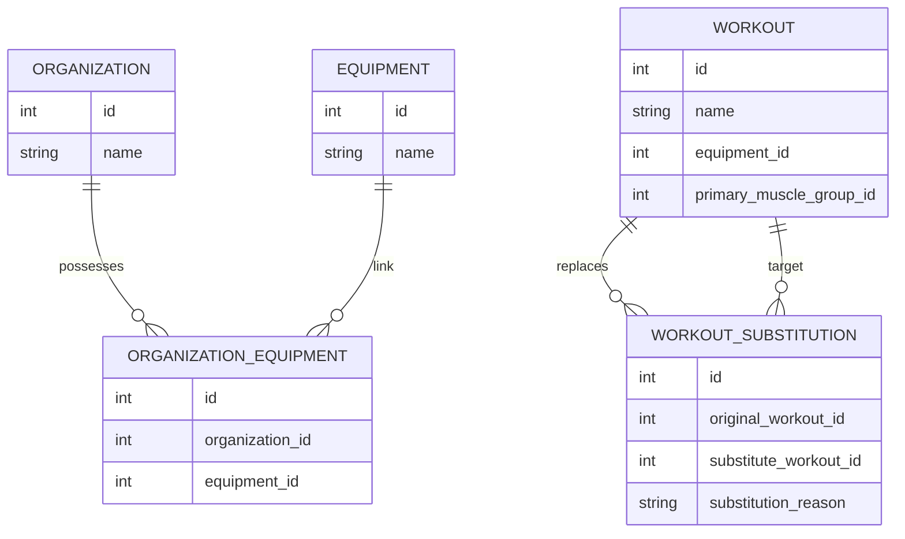

# 📐 Architecture Proposal: Gym-Specific Equipment & Smart Exercise Substitution

This document outlines the design and implementation strategy for handling cases where a gym does not have all the equipment required for a scheduled workout. 

---

## 💡 The Core Idea: Hybrid Smart Substitution
Instead of relying **only** on manual filtering or **only** on AI (which can be slow and expensive), we propose a **hybrid approach**:
1.  **Gym Inventory Profile**: Gym owners check off what equipment they have.
2.  **Deterministic Filters**: The app flags workouts requiring missing equipment.
3.  **AI Swap Engine (Gemini / ChatGPT)**: If a user encounters a missing machine, they click **"Swap Exercise"**, and the AI recommends substitutes based on what equipment *is* available at that gym.

---

## 🗄️ 1. Database Schema Additions (Django)

We need to associate equipment with specific gyms (organizations) and allow alternative exercise mappings.



### 1.1: Gym Equipment Mapping Model
In `apps/fitnesscenter/models.py`:
```python
class GymEquipment(models.Model):
    organization = models.ForeignKey('fitnesscenter.Organization', on_delete=models.CASCADE, related_name='gym_equipments')
    equipment = models.ForeignKey('trainer.Equipment', on_delete=models.CASCADE)
    is_functional = models.BooleanField(default=True) # Useful if a machine is temporarily out-of-order
    created_at = models.DateTimeField(auto_now_add=True)

    class Meta:
        unique_together = ('organization', 'equipment')
```

---

## ⚙️ 2. The API Endpoints & Workflows

### Flow A: Flagging Workouts with Missing Equipment
When fetching the workout details for a customer exercising at a specific gym:
1.  Get the organization ID of the customer's active membership.
2.  Fetch all `equipment_id`s possessed by that organization.
3.  For each exercise in the workout, check if its required `equipment_id` is in the gym's list.
4.  If not, set `is_available_at_gym: false` in the API response so the UI shows an alert icon (e.g. ⚠️ *Equipment missing at this gym*).

---

### Flow B: Smart Exercise Swap (Deterministic + AI)
When a user clicks "Swap Exercise" because their gym is missing the machine:

```
[User clicks "Swap"] 
       │
       ▼
[Look up Static Alternatives in DB] ──(Found?)──► [Show Static Alternatives]
       │ (No)
       ▼
[Call AI Swap API (Gemini/GPT)]
       │
       ├─► Send: Active Exercise, Target Muscle Group
       ├─► Send: List of available equipment at this gym
       ▼
[AI returns top 3 matching exercises using available equipment]
       │
       ▼
[User selects alternative & swaps in active session]
```

#### The AI Prompt Template:
```text
You are an expert fitness coach and trainer. 
The user is at a gym that ONLY has the following equipment: {available_gym_equipment}.
They need to replace the exercise "{original_exercise}" which requires "{missing_equipment}" and targets the "{muscle_group}" muscle.

Provide 3 alternative exercises that:
1. TARGET the exact same muscle group.
2. ONLY use the equipment available in the gym.
3. Can be performed as direct replacements.

Return the response strictly as a JSON array of objects:
[
  {
    "exercise_name": "Substitute Name",
    "required_equipment": "Equipment Used",
    "difficulty": "Beginner/Intermediate/Advanced",
    "execution_tips": "Brief tip on how to perform this substitute."
  }
]
```

---

## 🤖 3. Why the AI (Gemini/ChatGPT) Approach Wins
Using an LLM API here is ideal because:
1.  **Infinite Combinations**: Mappings of alternatives for thousands of custom exercises is hard to maintain statically. AI understands the biomechanics of movement and can swap a "Barbell Bench Press" to a "Floor Pushup" if the gym has *zero* equipment.
2.  **Dynamic Adaptability**: If a gym has a cable crossover but no dumbbells, the AI instantly adapts, whereas a hardcoded system might fail.
3.  **Low Latency & Cost**: Because it's only triggered when a user clicks "Swap" (instead of on every page load), the API call volume is low, keeping costs negligible.
