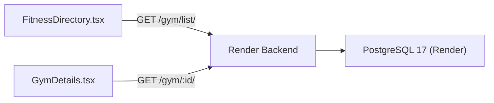

# Postman Guide — Gym List & Detail API

> [!IMPORTANT]
> **Backend Base URL:** `https://discipl-backend-u0w9.onrender.com/api/v1`
> The backend is hosted on Render (Python 3 / Django). First requests may take ~30s if the server is cold.

---

## 1. List All Gyms (Public — No Auth Required)

| Field | Value |
|-------|-------|
| **Method** | `GET` |
| **URL** | `https://discipl-backend-u0w9.onrender.com/api/v1/fitnesscenter/gym/list/` |

### Headers
```
X-Platform: web
```

### Expected Response (200 OK)
```json
{
  "count": 5,
  "next": null,
  "previous": null,
  "results": [
    {
      "id": 1,
      "name": "AARC1 Fitness",
      "description": "Premium fitness center...",
      "email": "aarc1@gym.com",
      "phone_number": "+919876543210",
      "logo": "https://...",
      "slug": "aarc1-fitness",
      "active": true,
      "is_public": true,
      "registration_status": "approved",
      "categories": [{"id": 1, "name": "Gym"}],
      "location": {
        "city": "Petta",
        "state": "Kerala",
        "building_name": "Main Road"
      },
      "mentor_name": "John Doe",
      "review_count": 12,
      "average_rating": "4.50",
      "created_at": "2026-01-15T10:30:00Z"
    }
  ]
}
```

### Key Response Fields

| Field | Type | Description |
|-------|------|-------------|
| `id` | int | Gym ID (use for detail endpoint) |
| `name` | string | Gym display name |
| `categories` | array | `[{id, name}]` — e.g. "Gym", "Yoga" |
| `location` | object | `{city, state, building_name}` |
| `logo` | string/null | URL to gym logo image |
| `average_rating` | string | Rating like "4.50" |
| `review_count` | int | Number of reviews |
| `mentor_name` | string/null | Owner's name |
| `is_public` | bool | Whether gym is publicly visible |

---

## 2. Get Gym Details (Public — No Auth Required)

| Field | Value |
|-------|-------|
| **Method** | `GET` |
| **URL** | `https://discipl-backend-u0w9.onrender.com/api/v1/fitnesscenter/gym/<GYM_ID>/` |

Replace `<GYM_ID>` with the gym's `id` from the list response.

### Headers
```
X-Platform: web
```

### Expected Response (200 OK)
```json
{
  "id": 1,
  "name": "AARC1 Fitness",
  "description": "Premium fitness center...",
  "email": "aarc1@gym.com",
  "phone_number": "+919876543210",
  "logo": "https://...",
  "location": {
    "city": "Petta",
    "state": "Kerala",
    "building_name": "Main Road",
    "latitude": "10.0123",
    "longitude": "76.3456"
  },
  "categories": [{"id": 1, "name": "Gym"}],
  "amenities": [
    {"id": 1, "name": "Free Weights"},
    {"id": 2, "name": "Cardio Equipment"}
  ],
  "photos": [
    {"id": 1, "image": "/media/photos/gym1.jpg", "caption": "Main Hall", "is_primary": true}
  ],
  "packages": [
    {
      "id": 1,
      "name": "Monthly Plan",
      "duration_days": 30,
      "price": "2499.00",
      "description": "Full gym access",
      "is_active": true
    }
  ],
  "time_slots": [
    {
      "id": 1,
      "name": "Morning Batch",
      "start_time": "06:00:00",
      "end_time": "08:00:00",
      "is_active": true,
      "start_date": null,
      "end_date": null
    }
  ],
  "social_media": [
    {"platform": "instagram", "url": "https://instagram.com/aarc1fitness"}
  ],
  "working_days": [
    {"day": "monday", "is_open": true, "morning_opening_time": "06:00:00", "morning_closing_time": "12:00:00"}
  ],
  "review_count": 12,
  "average_rating": "4.50",
  "is_public": true
}
```

---

## 3. Create a Gym (Public — No Auth Required)

| Field | Value |
|-------|-------|
| **Method** | `POST` |
| **URL** | `https://discipl-backend-u0w9.onrender.com/api/v1/fitnesscenter/gym/create/` |

### Headers
```
Content-Type: application/json
X-Platform: web
```

### Body (raw JSON)
```json
{
  "name": "Test Gym via Postman",
  "categories": [1],
  "email": "testgym@example.com",
  "phone_number": "+919999988888",
  "description": "A test gym created via Postman for verification."
}
```

### Expected Response (201 Created)
Returns the full gym object with generated `id`.

---

## 4. Frontend → Backend Connection Map



### How the frontend connects:

| Frontend File | API Endpoint | What it does |
|---------------|-------------|--------------|
| `src/config/api.ts` | Base URL config | Points to `https://discipl-backend-u0w9.onrender.com/api/v1` |
| `src/pages/FitnessDirectory.tsx` | `GET .../fitnesscenter/gym/list/` | Fetches all gyms, maps to cards |
| `src/pages/GymDetails.tsx` | `GET .../fitnesscenter/gym/{id}/` | Fetches single gym with plans, slots, amenities |

### Field Mapping (API → Frontend)

| API Field | Frontend Usage |
|-----------|---------------|
| `name` | Card title / Detail page header |
| `categories[0].name` | Category badge |
| `location.city + state` | Address line |
| `logo` | Card image / Detail logo |
| `average_rating` | Star rating display |
| `review_count` | Review count badge |
| `phone_number` | Contact info |
| `packages` | Membership plans section |
| `time_slots` | Schedule section with live/inactive badges |
| `amenities` | Amenity chips |
| `photos` | Banner image + Gallery grid |

---

## 5. Quick Postman Setup Steps

1. **Open Postman** → Create a new Collection called `Discipl Gym API`
2. **Add Request** → `GET Gym List` with URL above
3. **Add Header** → `X-Platform: web`
4. **Send** → You should see paginated gym results
5. **Copy a gym `id`** from results
6. **Add Request** → `GET Gym Detail` with URL `https://discipl-backend-u0w9.onrender.com/api/v1/fitnesscenter/gym/{id}/`
7. **Send** → Full gym detail with plans, slots, amenities

> [!TIP]
> The Render backend auto-sleeps after inactivity. The **first request may take 30–60 seconds** to wake up. Subsequent requests are fast.

> [!NOTE]
> The gym list and detail endpoints are **public** — no JWT token required. Only gym create/update/delete operations require authentication.
